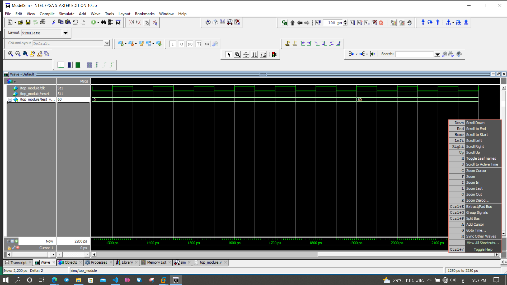

# 32-bit MIPS general purpose integer microprocessor & config it on FPGA

## Phases:

### Block diagram:
  The project aims to implement a 32-bit single-cycle MIPS RISC (Reduced Instruction Set Computer) processor based on Harvard architecture using verilog HDL.The   processor is simulated on ModelSim tool, and Synthesis is made using Intel® Quartus® Prime and also implemented on Cyclone® IV FPGA.

- Write RTL modules in Verilog and instantiate in TOP
- Simulate the TOP in Modelsim with 3 different programs: Factorial program, GCD of 
  two numbers program and Fibonacci sequence program
- Configurated it on Cyclone IV FPGA Kit using Intel® QUARTIS PRIME

